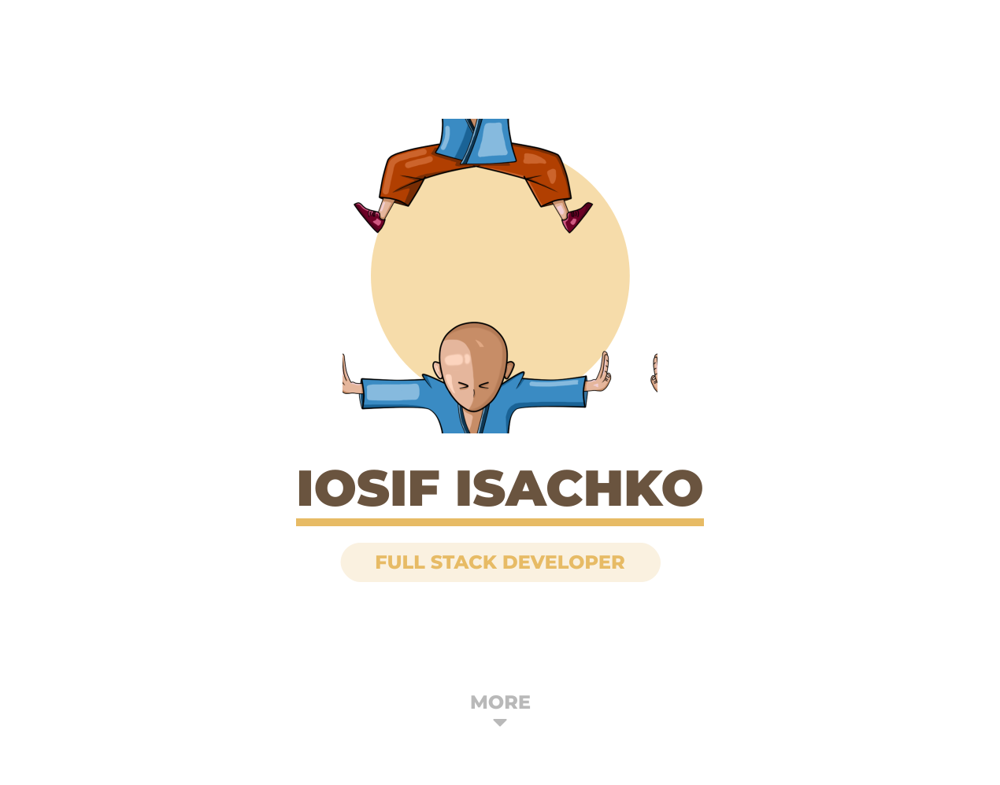

# WEBLand

> This is the open source code of my portfolio. \
> Thanks for attention.

### Links

> + [Source Code][sourse-code]
> + [Live Site][live-site]

[sourse-code]: https://github.com/luamoris/webland
[live-site]: https://luamoris.github.io/webland/





### Prerequisites

> #### Node.js (^12.18.3, or >=14.0.0)


---


### Run Сode

#### Get `started`

```bash
	git clone https://github.com/luamoris/webland.git
	cd webland
	npm i
	npm start
```

#### For `build`

```bash
	npm run dev 	// development
	npm run build	// production
```

#### For `lint`

> - [`stylelint`][stylelint]
> - [`eslint`][eslint]

```bash
	npm run lint		// lint Javascript files
	npm run stylelint	// lint SCSS files
```


### Author

<p align="left">
	<a href="https://github.com/luamoris">
		
	</a>
</p>


---


[stylelint]: https://stylelint.io/
[eslint]: https://eslint.org/

[logo]: https://raw.githubusercontent.com/luamoris/webpack-boilerplate/276b2451ca1f7d11d6cddb83ae3418105511396b/src/img/box.svg
[github]: https://github.com/luamoris/webpack-boilerplate
